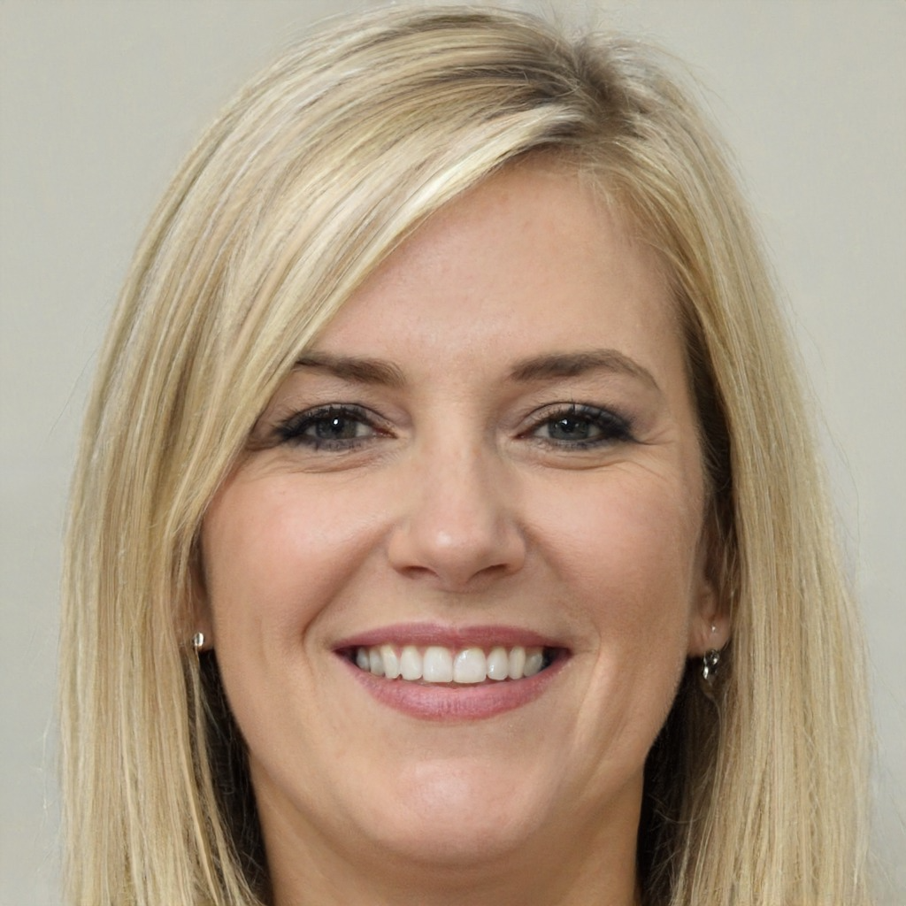

# Especificações do Projeto

Pré-requisitos: <a href="1-Documentação de Contexto.md"> Documentação de Contexto</a>

Definição do problema e ideia de solução a partir da perspectiva do usuário. É composta pela definição do  diagrama de personas, histórias de usuários, requisitos funcionais e não funcionais além das restrições do projeto.

Apresente uma visão geral do que será abordado nesta parte do documento, enumerando as técnicas e/ou ferramentas utilizadas para realizar a especificações do projeto

## Personas

As personas levantadas durante o processo de entendimento do problema são apresentadas nas Figuras seguintes.
<table>
    <tbody>
        <tr>
            <td colspan="1" rowspan="2" style="text-align:center; vertical-align:middle;">
                

                    
                

            </td>
            <td colspan="2" rowspan="1" style="text-align:center;">
                <b>Juliana</b>
            </td>
        </tr>
        <tr>
            <td colspan="2">
                <b>Idade:</b> 32  
                <b>Ocupação:</b> Esteticista Autônoma  
                <b>Experiência:</b> 8 anos
            </td>
        </tr>
        <tr>
            <td>
                <b style="text-align:center; display:block;">Motivações</b>
                : Juliana deseja alcançar uma clientela fiel e expandir sua agenda. Ela espera que o Bellus Click possa ajudá-la a aumentar sua presença online e automatizar processos para que possa focar mais em seus atendimentos e menos em marketing.
            </td>
            <td>
                <b style="text-align:center; display:block;">Frustrações</b>
                : Juliana luta para captar novos clientes, dependendo apenas de indicações e marketing boca a boca. Ela sente que suas redes sociais não têm o alcance necessário e que, muitas vezes, acaba perdendo clientes para concorrentes que investem mais em marketing digital.
            </td>
        </tr>
    </tbody>
</table>

 
<table>
    <tbody>
        <tr>
            <td colspan="1" rowspan="2" style="text-align:center; vertical-align:middle;">
                

                    
                

            </td>
            <td colspan="2" rowspan="1" style="text-align:center;">
                <b>Carlos</b>
            </td>
        </tr>
        <tr>
           <td colspan="2">
                <b>Idade:</b> 40  
                <b>Ocupação:</b> Gestor de Clínica de Estética  
                <b>Experiência:</b> 15 anos
            </td>
        </tr>
        <tr>
            <td>
                <b style="text-align:center; display:block;">Motivações</b>
                : Carlos quer otimizar o controle financeiro da clínica, automatizando o processo e obtendo relatórios detalhados e em tempo real. Ele espera que o Bellus Click ofereça uma solução integrada que o ajude a gerenciar suas finanças de forma mais eficiente.
            </td>
            <td>
                <b style="text-align:center; display:block;">Frustrações</b>
                : Carlos gerencia uma clínica de médio porte e sua maior dificuldade é controlar o fluxo de caixa. Ele sente que a falta de um sistema eficiente faz com que perca tempo com relatórios financeiros manuais, além de não ter uma visão clara e imediata do desempenho financeiro da clínica.
            </td>
        </tr>
    </tbody>
</table>

 
<table>
    <tbody>
        <tr>
            <td colspan="1" rowspan="2" style="text-align:center; vertical-align:middle;">
                

                    
                

            </td>
            <td colspan="2" rowspan="1" style="text-align:center;">
                <b>Mariana</b>
            </td>
        </tr>
        <tr>
            <td colspan="2">
                <b>Idade:</b> 24  
                <b>Ocupação:</b> Recém-Formada em Estética  
                <b>Experiência:</b> 1 ano
            </td>
        </tr>
        <tr>
            <td>
                <b style="text-align:center; display:block;">Motivações</b>
                : Mariana espera que o Bellus Click possa ajudá-la a organizar seus horários de forma eficiente, permitindo que se concentre em oferecer um excelente atendimento e construir uma base de clientes sólida.
            </td>
            <td>
                <b style="text-align:center; display:block;">Frustrações</b>
                : Mariana acabou de se formar e está tendo dificuldade em estabelecer sua própria clientela. Ela sente que, por ser nova no mercado, precisa se destacar, mas não sabe por onde começar, especialmente em                     relação ao agendamento e organização dos atendimentos.
            </td>
        </tr>
    </tbody>
</table>

 
<table>
    <tbody>
        <tr>
            <td colspan="1" rowspan="2" style="text-align:center; vertical-align:middle;">
                

                    
                

            </td>
            <td colspan="2" rowspan="1" style="text-align:center;">
                <b>Renata</b>
            </td>
        </tr>
        <tr>
            <td colspan="2">
                <b>Idade:</b> 36  
                <b>Ocupação:</b> Manicure e Pedicure Experiente  
                <b>Experiência:</b> 12 anos
            </td>
        </tr>
        <tr>
            <td>
                <b style="text-align:center; display:block;">Motivações</b>
                : Renata quer um sistema que possa ajudar a automatizar e confirmar os agendamentos, evitando no-shows e melhorando sua organização. Ela espera que o Bellus Click possa proporcionar uma agenda digital                        confiável e fácil de usar.
            </td>
            <td>
                <b style="text-align:center; display:block;">Frustrações</b>
                : Renata é uma profissional experiente que tem uma boa clientela, mas enfrenta dificuldades em gerenciar seu tempo, especialmente com agendamentos que não são honrados. Isso resulta em perda de tempo e,                      consequentemente, de dinheiro.
            </td>
        </tr>
    </tbody>
</table>

 
<table>
    <tbody>
        <tr>
            <td colspan="1" rowspan="2" style="text-align:center; vertical-align:middle;">
                

                    
                

            </td>
            <td colspan="2" rowspan="1" style="text-align:center;">
                <b>Tiago</b>
            </td>
        </tr>
        <tr>
            <td colspan="2">
                <b>Idade:</b> 45  
                <b>Ocupação:</b> Dono de Franquia de Estética  
                <b>Experiência:</b> 20 anos
            </td>
        </tr>
        <tr>
            <td>
                <b style="text-align:center; display:block;">Motivações</b>
                : Tiago espera que o Bellus Click possa unificar o sistema de agendamento e controle de clientes em todas as suas unidades, proporcionando uma experiência uniforme e eficiente para todas as suas clientes.                    Ele também busca uma solução que facilite o treinamento de novos funcionários.
            </td>
            <td>
                <b style="text-align:center; display:block;">Frustrações</b>
                : Tiago possui várias unidades de uma franquia de estética e seu principal desafio é padronizar o atendimento e o processo de agendamento em todas as unidades. A falta de um sistema centralizado torna a                      gestão das unidades muito complicada.
            </td>
        </tr>
    </tbody>
</table>

## Histórias de Usuários

Com base na análise das personas forma identificadas as seguintes histórias de usuários:

|EU COMO... `PERSONA`| QUERO/PRECISO ... `FUNCIONALIDADE` |PARA ... `MOTIVO/VALOR`                 |
|--------------------|------------------------------------|----------------------------------------|
| Esteticista Autônoma | Atrair novos clientes e expandir minha presença online | Alcançar uma clientela fiel e automatizar processos |
| Recém-Formada em Estética | Coletar e exibir avaliações positivas dos clientes | Construir minha reputação e atrair mais clientes |
| Manicure e Pedicure Experiente | Facilitar o agendamento dos meus serviços pelos clientes | Otimizar o uso do meu tempo e atender mais clientes |
| Esteticista Autônoma | Enviar lembretes automáticos aos clientes | Reduzir cancelamentos e faltas |
| Recém-Formada em Estética | Oferecer aos clientes opções flexíveis de agendamento | Atender mais pessoas sem sobrecarregar minha agenda |
| Gestor de Clínica de Estética | Gerar relatórios financeiros mensais automaticamente | Monitorar com precisão o fluxo de caixa |
| Esteticista Autônoma | Calcular o lucro de cada serviço oferecido | Ajustar preços e maximizar meus ganhos |
| Dono de Franquia de Estética | Centralizar o controle financeiro de todas as unidades | Ter uma visão consolidada e estratégica do negócio |
| Esteticista Autônoma | Registrar o histórico de serviços de cada cliente | Oferecer um atendimento mais personalizado |
| Esteticista Autônoma | Sincronizar meu calendário com dispositivos móveis | Melhorar a organização dos meus horários |

## Requisitos

As tabelas que se seguem apresentam os requisitos funcionais e não funcionais que detalham o escopo do projeto.

### Requisitos Funcionais

|ID    | Descrição do Requisito  | Prioridade |
|------|-----------------------------------------|----|
|RF-001| A aplicação deve permitir criar uma conta do cliente e profissional| ALTA |  
|RF-002| A aplicação deve permitir a exclusão das contas dos clientes e profissionais| MÉDIA|
|RF-003| A aplicação deve permitir editar o perfil do cliente e profissional| MÉDIA|  
|RF-004| A aplicação deve permitir que os profissionais informem os harários de atendimentos| ALTA|  
|RF-005| A aplicação deve permitir que o cliente filtre profissionais próximos de sua localização|  ALTA|  
|RF-006| A aplicação deve permitir que o cliente escolha e marque uma data e horário| ALTA |   
|RF-007| A aplicação deve permitir gerar um relatório financeiro |ALTA |  
|RF-008| A aplicação deve permitir faça um controle de valores recebidos| MÉDIA |  
|RF-009| A aplicação deve permitir um sistema de notificações quando houver agendamento, reagendamento e cancelamento de um atendimento| ALTA |  
|RF-010| A aplicação deve permitir aos profissonais gerenciar estoque de produtos| BAIXA |  
|RF-011| A aplicação deve permitir que o cliente reagende um atendimento| ALTA |  
|RF-012| A aplicação deve permitir acessar um histórico de clientes| MÈDIA | 

### Requisitos não Funcionais

|ID     | Descrição do Requisito  |Prioridade |
|-------|-------------------------|----|
|RNF-001| A aplicação deve ser responsiva | ALTA | 
|RNF-002| A aplicação deve processar requisições do usuário em no máximo 15s |  BAIXA |  
|RNF-003| A aplicação deve ser acessível.| ALTA |  
|RNF-004| A aplicação deve ter a opção de fazer o login com Google.| ALTA |  

## Restrições

O projeto está restrito pelos itens apresentados na tabela a seguir.

|ID| Restrição                                                   |
|--|-------------------------------------------------------------|
|01| O projeto deverá ser entregue até o final do semestre       |
|02| O framework ou biblioteca utilizado deverá ser apenas o BootStrap |
|03| Deverá ser utilizado html, css e javascript                  |
|04| A interface deve ser intuitiva e fácil de usar              |
|05| Não poder ser utilizado uma linguagem de programação diferente de C# no desenvolvimento do back-end |

## Diagrama de Casos de Uso

O diagrama de casos de uso é o próximo passo após a elicitação de requisitos, que utiliza um modelo gráfico e uma tabela com as descrições sucintas dos casos de uso e dos atores. Ele contempla a fronteira do sistema e o detalhamento dos requisitos funcionais com a indicação dos atores, casos de uso e seus relacionamentos. 

