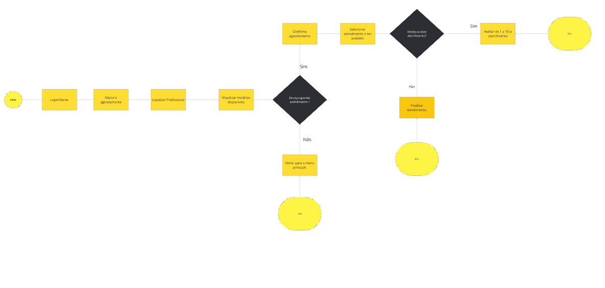
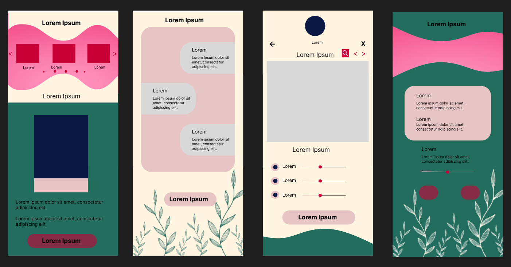
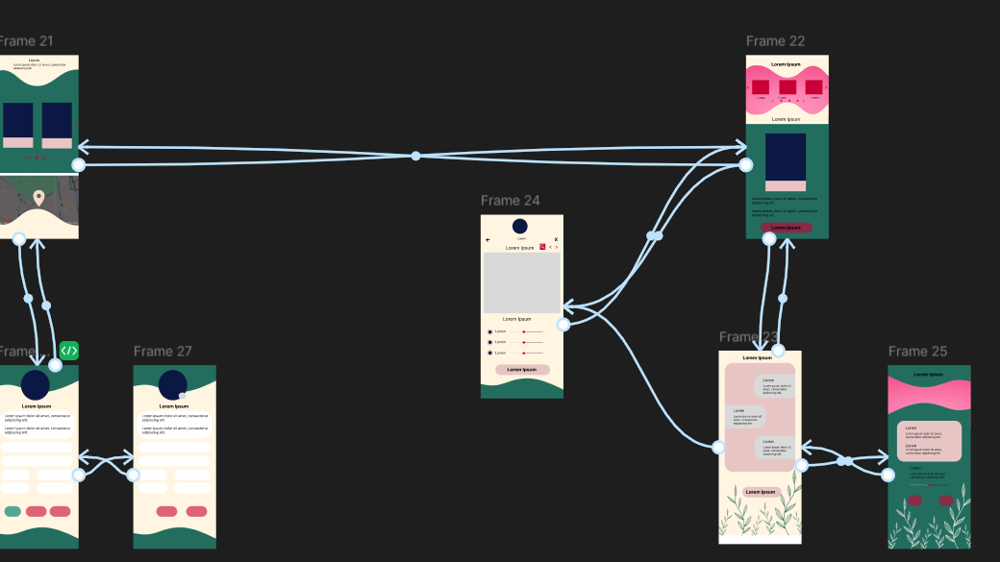

# Projeto de Interface

Pré-requisitos: <a href="2-Especificação do Projeto.md"> Documentação de Especificação</a>

O Projeto de Interface consiste em uma documentação que explora uma visão geral da interação do usuário com as interfaces do sistema. Destacando também o protótipo de suas principais telas com as funcionalidades que fazem parte da aplicação, especificadas na <a href="2-Especificação do Projeto.md"> Documentação de Especificação</a>.

## Diagrama de Fluxo

O Bellus Click começa com a entrada dos clientes, focado por meios de agendamentos online, com o objetivo de proporcionar uma experiência estética personalizada. A etapa seguinte é a forma do tratamneto marcado levando a o trabalho nas casas, onde especialistas avaliam as necessidades do cliente e recomendam tratamentos adequados, como cuidados do corpo.

Após o término, ocorre o feedback e avaliação, onde o cliente oferece sua opinião, ajudando a empresa a aperfeiçoar seus serviços. O grupo também investe em melhoria contínua, baseada em análises de feedbacks e treinamentos da equipe para garantir resultados excepcionais.

Avaliação do Profissional 
 Avaliação do cliente! 
 Disponibilizar horarios 
 Agendamentos 
 Cadastrar Produto em Estoque 
  Relatorio Financeiro 

## Wireframes

São protótipos usados em design de interface para sugerir a estrutura de um site web e seu relacionamentos entre suas páginas. Um wireframe web é uma ilustração semelhante do layout de elementos fundamentais na interface.

#### Homepage
 

#### Página de Login

#### Página de Cadastro

### Bellus Click - Versão para as Profissionais

#### Página Inicial 

#### Páginas Agenda/Disponibilização de Horários 

#### Páginas Financeiro/Relatórios 

#### Páginas Clientes/Histórico 

#### Páginas Gerenciamento de Estoque

#### Páginas Perfil/Atualização de Dados

### Bellus Click - Versão para as Clientes

#### Página Inicial Para Cliente 

 

 #### Páginas Perfil/Atualização de Dados das Clientes 

 

 #### Páginas de Agendamentos e Perfil da Profissional na Visão da Cliente 
 

 
 ### Fluxo Wireframes 

